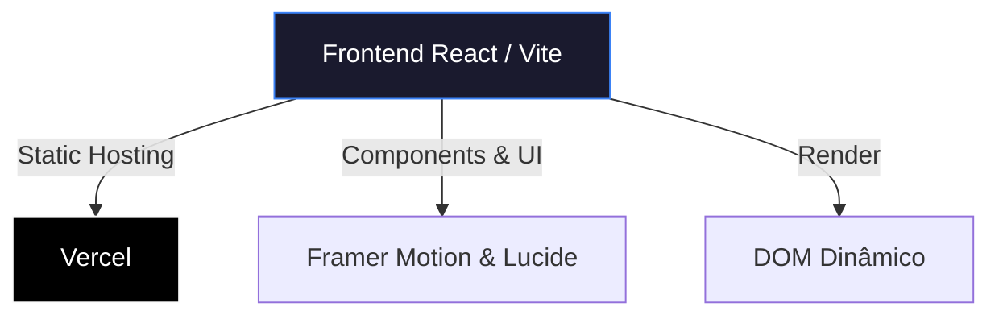

# Vinícius Franco - Portfolio

Repositório do meu portfólio pessoal, feito em React e Vite.

🚀 **[Acessar Portfólio Online](https://portifolio-orcin-seven-27.vercel.app)**

## Stack Tecnológica

- **Front-end**: React, TypeScript, Vite
- **Estilização**: CSS puro (com algumas variáveis globais para a paleta de cores)
- **Animações**: Framer Motion
- **Ícones**: Lucide React

## Arquitetura do Projeto



## Rodando Localmente

1. Clone o repositório.
2. Instale as dependências:
   ```bash
   npm install
   ```
3. (Opcional) Copie o arquivo `.env.example` para `.env.local` caso vá usar alguma variável de ambiente:
   ```bash
   cp .env.example .env.local
   ```
4. Inicie o servidor de desenvolvimento:
   ```bash
   npm run dev
   ```

O app ficará disponível acessando `http://localhost:5173`.
